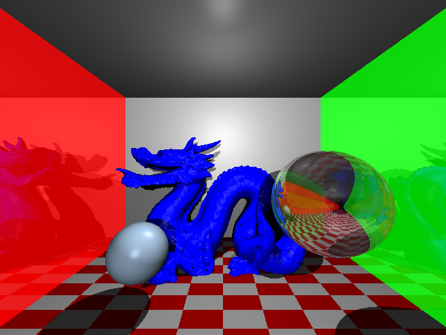
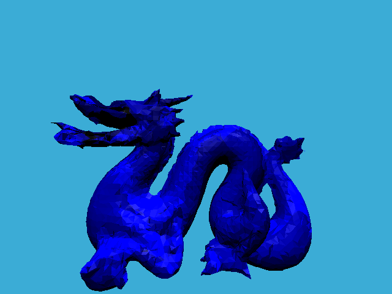
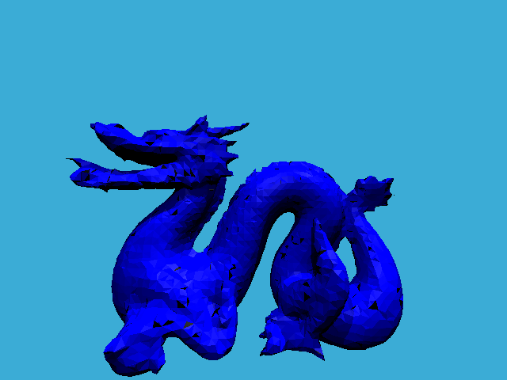

# Simple Ray Tracer
A simple ray tracer with Bounding Volume Hierarchy.

Triangle count : 47,803

Rendering Time : 3240(s)

## Acceleration performance comparison

Without BVH | Wit BVH
---|---
 | 
Rendering Time : 714(s) | Rendering Time : 272(s)

###### 